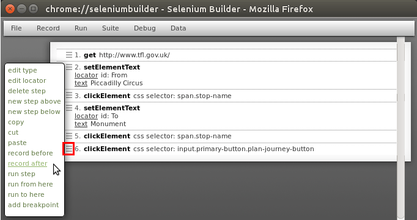
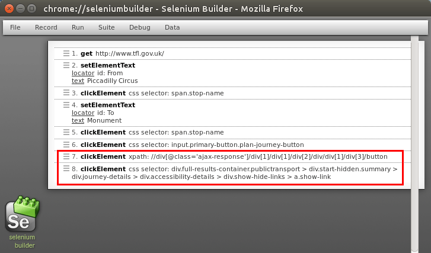
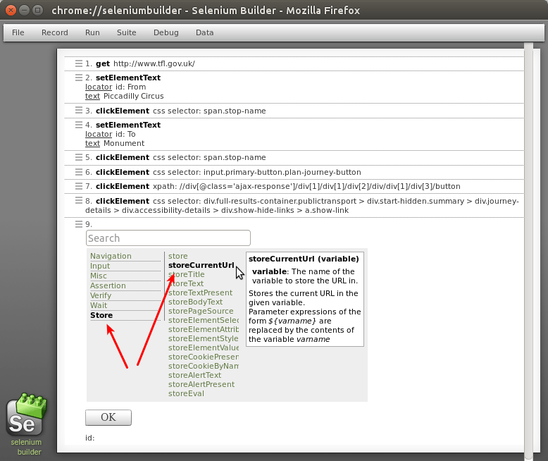
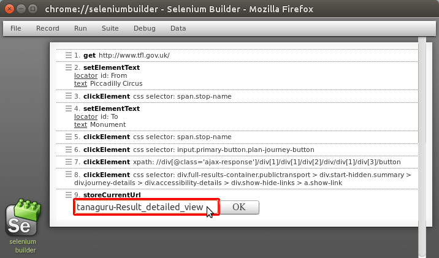
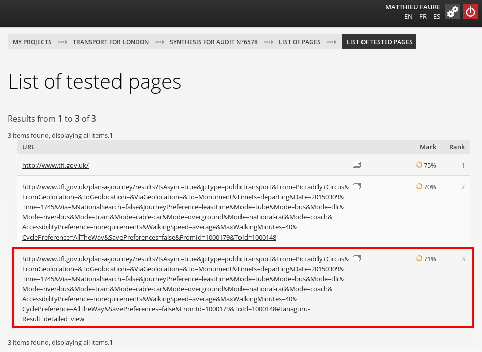

# Asqatasun scenario advanced usage

## Triggering additional audits in a scenario

Inside a given scenario, an audit is triggered each time the URL changes (e.g. when
the user clicks a links or submits a form button).

You may trigger additional audits by adding the Selenium command `storeCurrentUrl`.

Let's enhance the [*Transport for London* example](userdoc-scenario-audit.md).
Say once we have the list of possible paths, we want to evaluate the accessibility
of the page, *showing the details of a path*.

* We complete the existing scenario. Replay the scenario already created, then click
the little menu icon besides the last step (numbered 6 in our example), and
choose *Record after*.

* Let say we want to view the detail of the second path, and also have information
about its accessibility. 

If sent as is in Asqatasun, the result of the scenario won't show the "third page"
(precisely the detail of the path shown by the Javascript button *View Details*).
We have to add a `storeCurrentUrl` command at the end of the scenario.

* Click on the mini-menu icon besides the last step, choose *new step below*.

* Click on *9 clickElement* and select *Store* and *storeCurrentUrl*

* Then click on *Variable* just next the `storeCurrentUrl`, and type `tanaguru-Result_detailed_view`.

The variable must be at least `tanaguru`. You may add a `-my_title_for_this_state_of_the_page`
to distinguish one `storeCurrentUrl` from another. 

* Upload the scenario to Asqatasun and launch it. You can now see a third "page" tested.

## Adding a pause

You may want to add a pause. This is typically used when a page is slow to respond.

To do this, add a Selenium command: click on the "mini-menu" besides a step and choose
*New step below*. Click on *clickElement* and choose *Misc* then *Pause*. Define
the duration of the pause in millisecondes.

## Adjust selectors

The [Webdriver element locator](https://addons.mozilla.org/en/firefox/addon/element-locator-for-webdriv/)
extension may be of a great help to adjust precisely the selectors used in a scenario.

