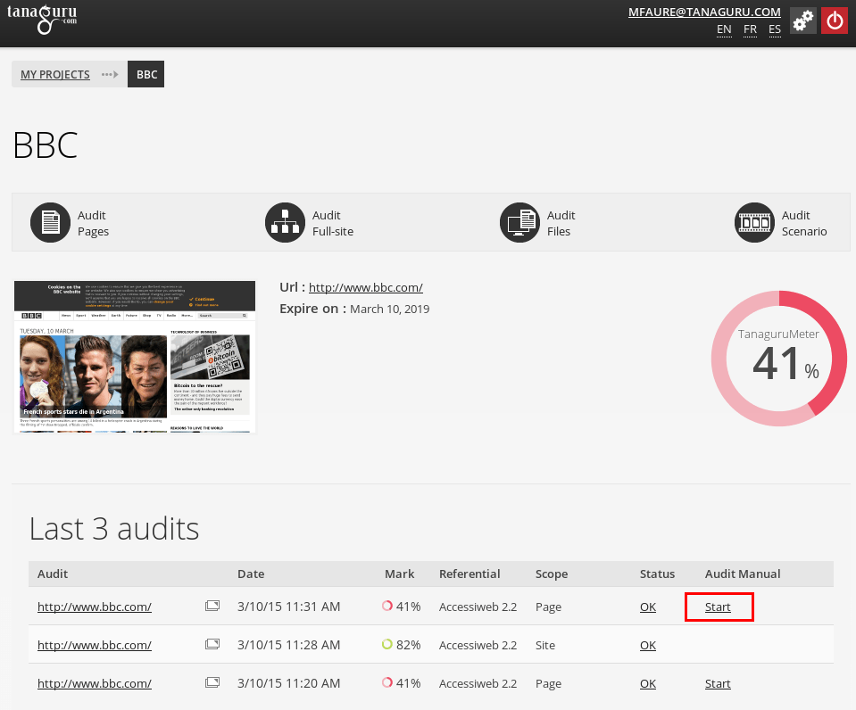
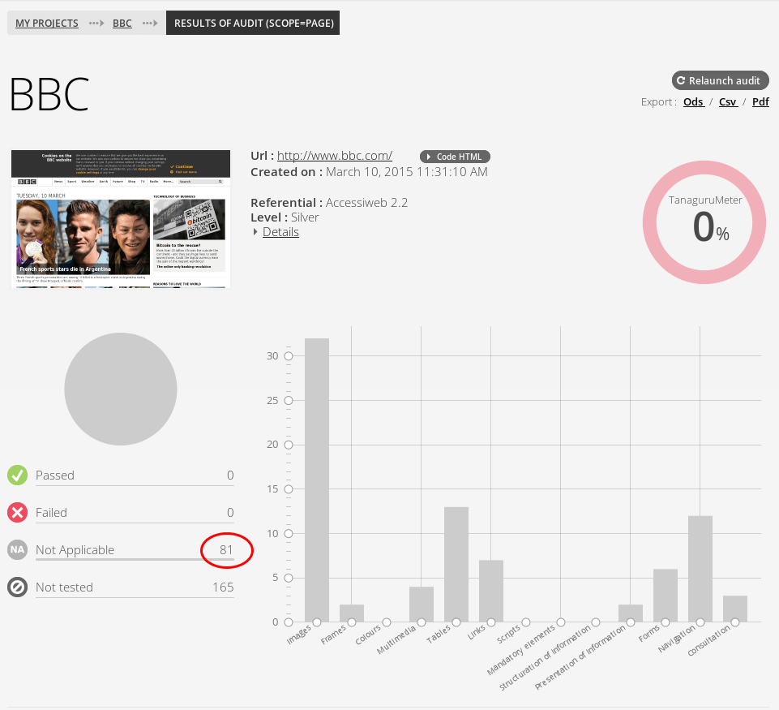
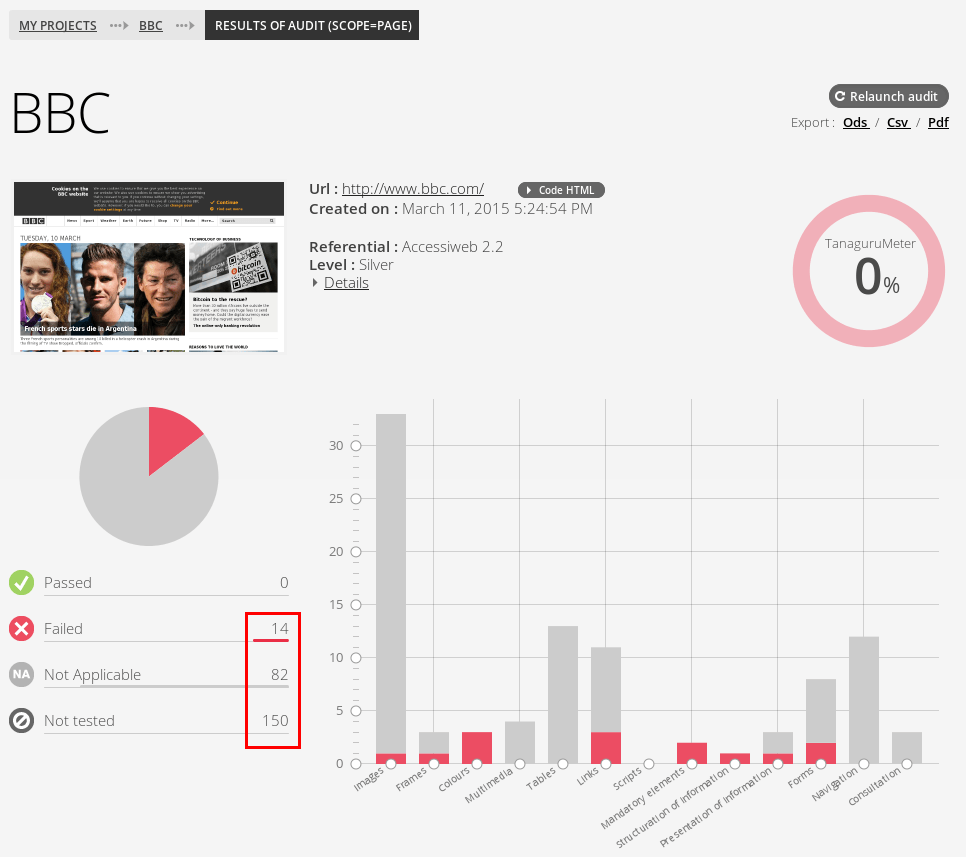
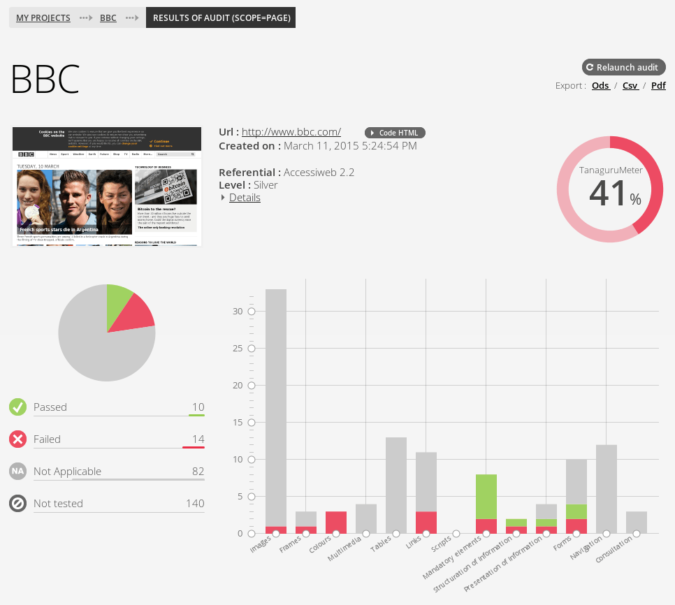
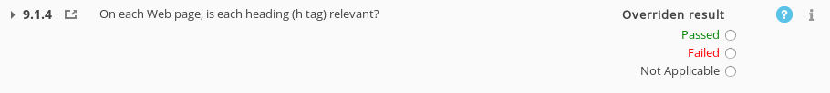
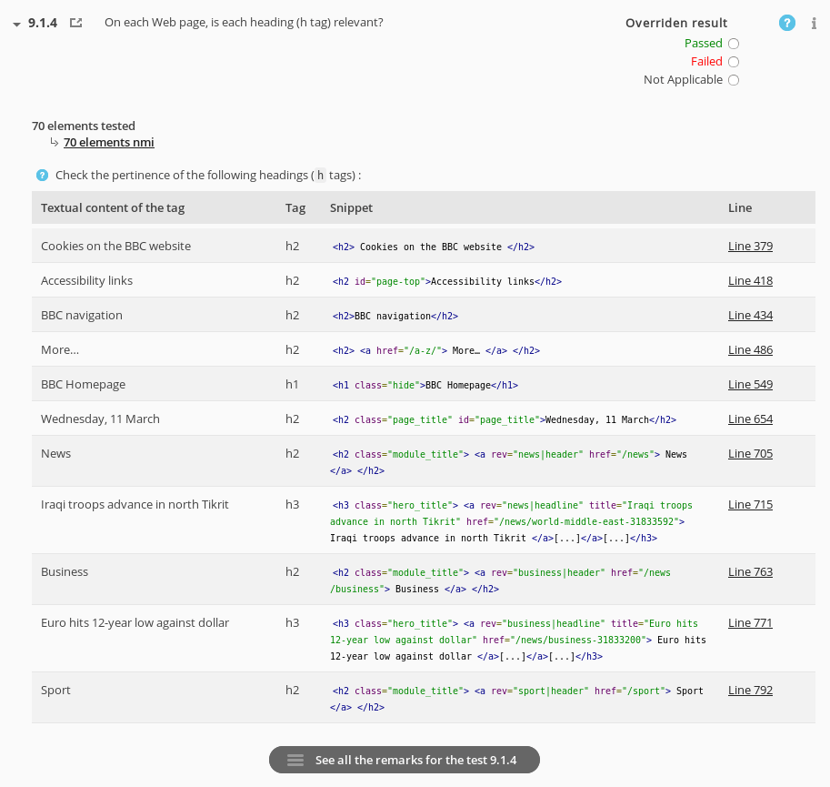
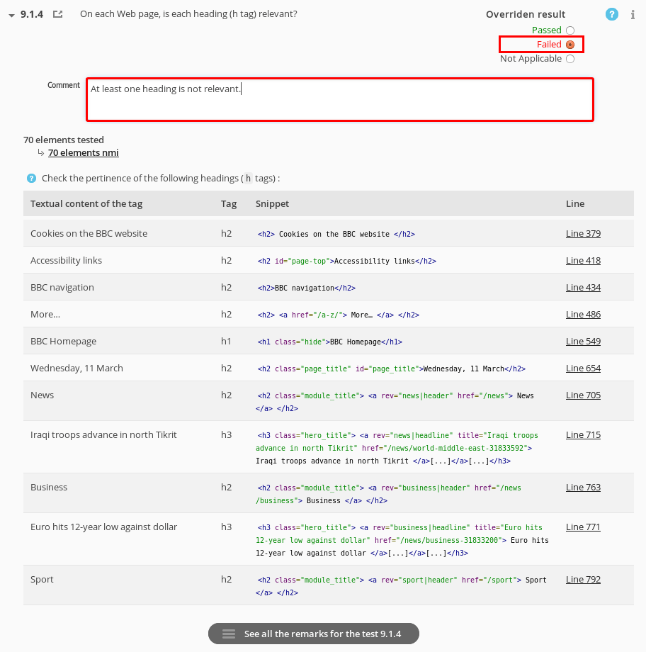

# Tanaguru Assisted Audit

Assisted audit offers auditors the ability to fulfill an audit. 

## Quick steps

1. Run a page audit,
1. Start the assisted audit,
1. Fulfill the whole audit, eventually in differents steps (work can be saved),
1. Terminate the audit.

## 1. Run a page audit

Let say we work on the [BBC website](http://www.bbc.com/). Launch an 
[accessibility audit of the page](userdoc-page-audit.md).

## 2. Begin the Assisted audit

Go to the project page, select a page audit and choose *Start*.

## 3. Workflow of the assisted audit

Once the assisted audit is begun, you can save your changes at any time and come
back later completing your work. When you consider the audit is done, you can close it.

The assisted audit begins "empty", letting the user choose his own way to fulfill
the audit. 

## 3. Add automated results

You can import the automated (definitive) results with the three buttons allowing you to:

* add Passed results,
* add Failed results,
* add Not Applicable results.

Don't forget to save you assisted audit after importing results.

You can see the audit being step by step as long as you include results.

### Adding Not Applicable results

At the very beginning of the assisted audit, we had 246 tests to complete (*Not Tested*).
Here we have:

* 81 Not Applicable results imported,
* There are 165 Not Tested left.

### Adding Failed Results

After importing the Passed results, we have decreased the number of Not Tested to
150. You can also note the graph getting shapes.

### Adding Passed results

After importing the Passed results, you can see the number of Not Tested 
**lowered from 246 to 140**.

You can also note the apparition of the score (see [Tanaguru Accessibility metric](userdoc-accessibility-metrics.md)
for the detail of the formula).

## 4. Add human results

For all the remaining *Not Tested* tests, you can define humanly the result.

To speed up you work you may want to treat a given theme, or leverage the Pre-Qualified
results. Those ones are results for which Tanaguru does not have enought clues to state
a definitive results, but can bring information that may help the auditor.

For each remaining tests you have to choose a definitive result (Passed, Failed 
or Not Applicable).

You can see the clues brought by Tanaguru by expanding the test (simply click on 
the label of the test). Here it is about the relevancy of the headings, which are
presented with their content and respective levels.

Regarding those clues, you just have to choose a definitive result. If you ever
select Failed or Not Applicable, you can add a comment to explain your choice.

## 5. Save and eventually close

Don't forget to save your work with the buttons at the bottom of the page

Once you consider your Assisted Audit done, you can *Close* it.

