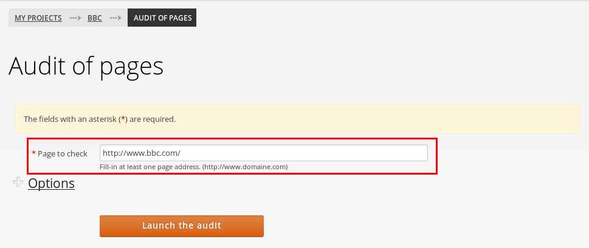
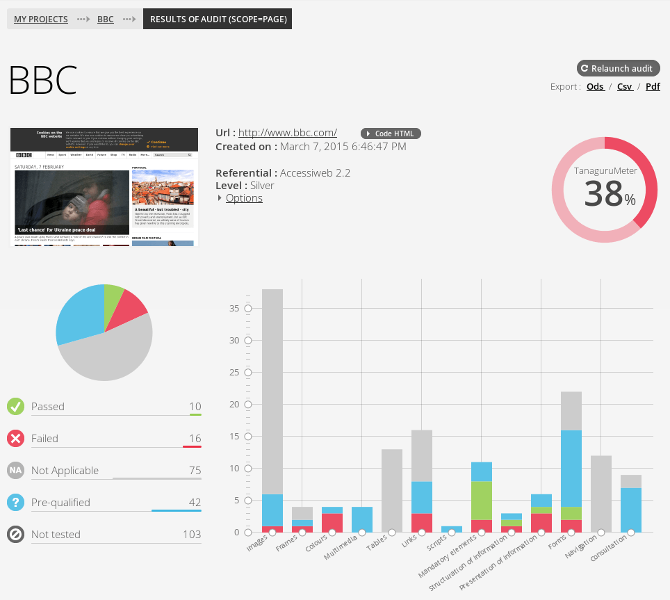
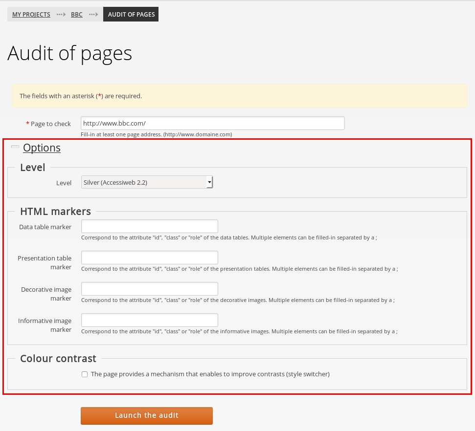

# Page audit of accessibility with Tanaguru

## Quick steps (for the impatient)

1. For a given project, click the *Audit pages* link
1. Click the *Launch the audit* button
1. Have the results

## Detailed steps

### Step 1

Let say we have a project for the [BBC website](http://www.bbc.com/), click the
*Audit pages* link. 

### Step 2a

Type in the URL of the page to be audited. 

**Notes:**

* The URL must be on the domain (here under www.bbc.com, like www.bbc.com/mypage.html)
* Sub-domains are considered different sites. E.g sports.bbc.com can't be audited
with the www.bbc.com project (you have to use a dedicated project for sports.bbc.com)

### Step 2b

Eventually adjust the [Options](#page-audit-options).

### Step 2c

Click the *Launch the audit* button.

### Step 3

Have the result.

## Page audit options

### Level

For a given referential, select a level (priority), for instance A, AA or AAA.

### HTML markers

HTML Markers are used to increase automation. Please see the [dedicated page for 
HTML markers ](userdoc-HTML-markers.md)

### Colour contrast

This disables all the tests on colour contrasts. Check this box if the website
offers a CSS to have valid contrasts (like on [https://careers.societegenerale.com/](https://careers.societegenerale.com/)).
