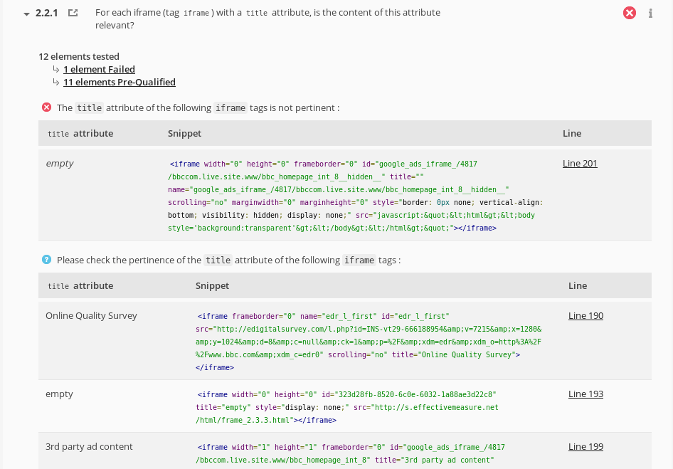
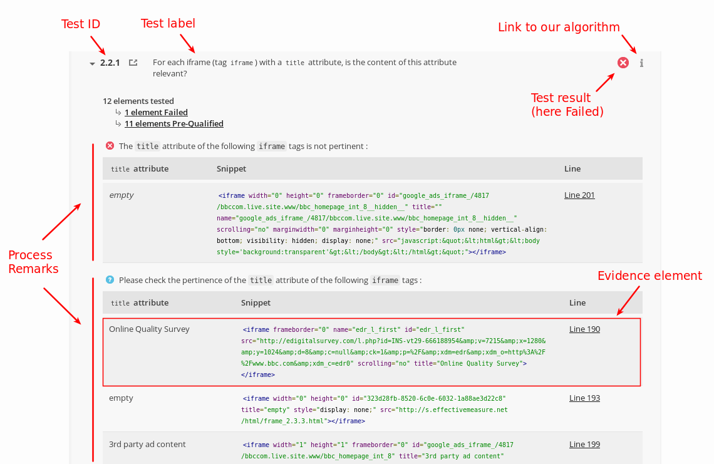
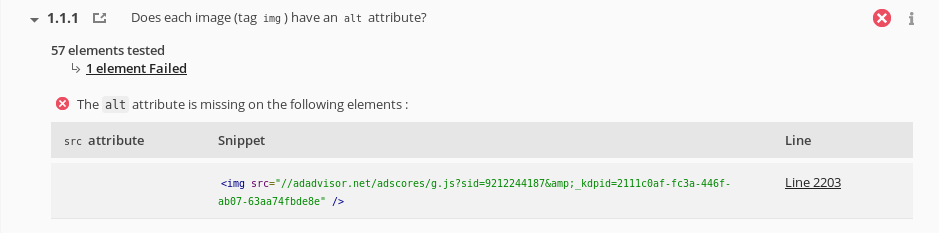
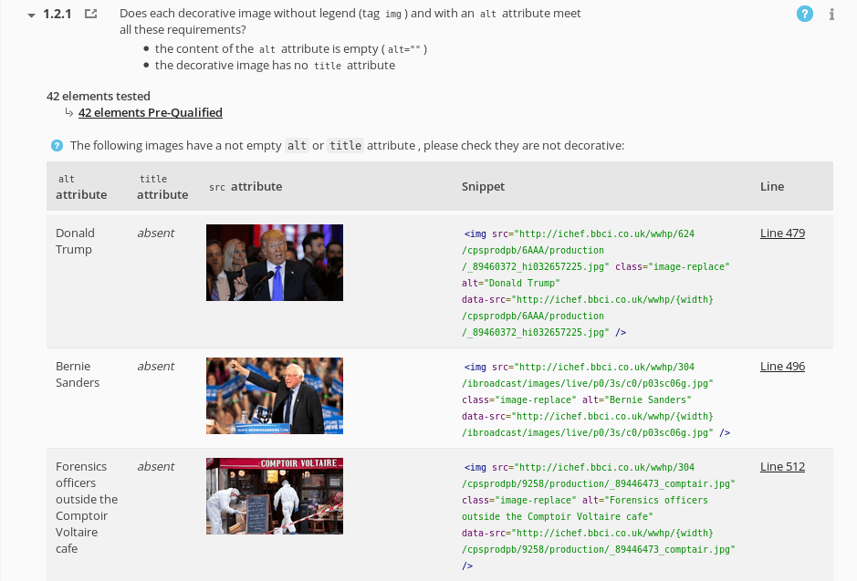
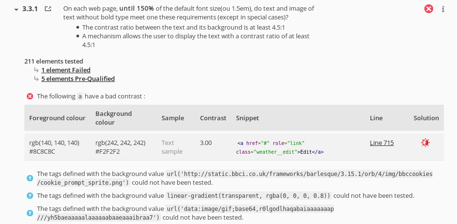
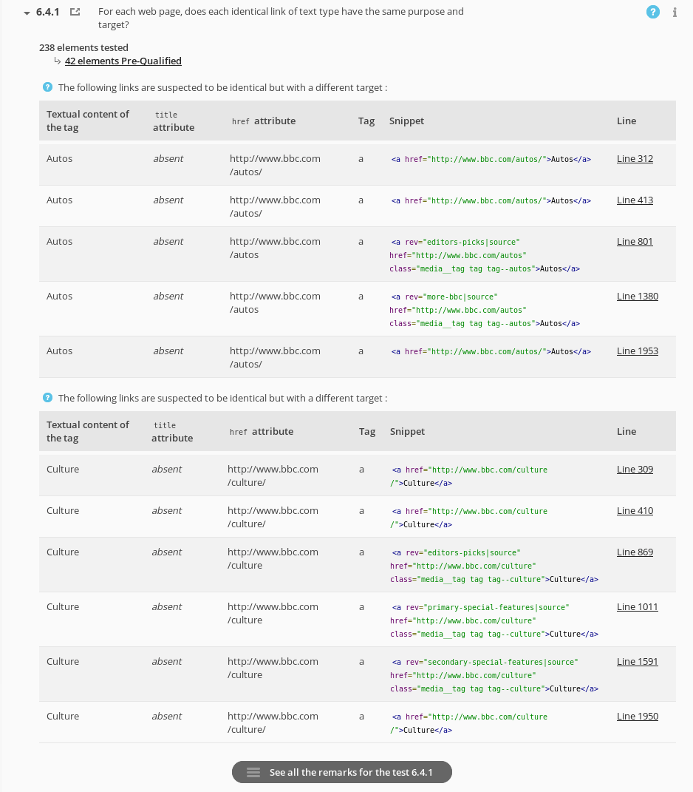
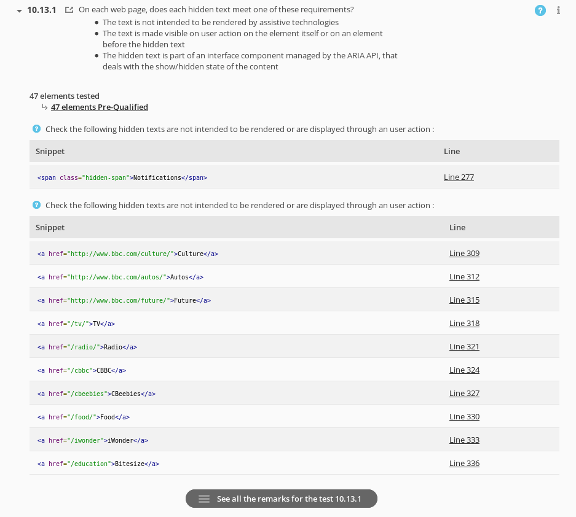

# Structure of a result

The result of a test looks like this (example on test 2.2.1 from RGAA 3 referential):

## The basics

You can see on a first row:

* the test identifier
* the label of the test (its description, what it does)
* the icon showing the result of the test (you remember, one of Passed, Failed, Not Applicable, Pre-Qualified or Not Tested)

## The counts

Then a section presents the counts:

* count of tested elements
* count of Failed elements
* count of Pre-Qualified elements

## Process remarks & Evidence elements

*Process Remarks* are pieces of information associated to a given result.
These information may be related to the Failed elements or to the Pre-Qualified elements, or both.

Each Process Remark may contain one or more *Evidence Element*, which are precise and detailed data
on:

* what deserves attention,
* why,
* and where in the source code

**Note:** the line indicated in the source code is relative to the source code shown by Asqatasun (as it is reformated, and may have been fixed if a tag was open and not closed).

## Examples

Same screenshot as above (test 2.2.1) with explanations:

## Various cases of Process Remarks

Process Remarks messages and Evidence Elements data vary from one test to another, and also depend on the actual HTML that is evaluated. Here are some examples. All examples are taken from Referential RGAA 3.

(These examples are here to enlighten diversity of Process Remarks and Evidence Elements. To go further, you may browse the exhaustive [list of Process Remarks codes](../30_Contributor_doc/Engine/Process_remarks_codes.md)).

### Process Remark and Evidence Elements on test 1.1.1

* Result: Failed.
* Process Remark: tells why test failed (`alt` missing)
* Evidence Element:
    * the actual image (not visible in this example),
    * the HTML snippet (code excerpt),
    * the line in the HTML source code

### Process Remark and Evidence Elements on test 1.2.1

* Result: Pre-Qualified.
* Process Remark: ask to verify if images are decorative or not
* Evidence Element: table of all identified images to be verified, with their respective:
    * `alt`,
    * `title`,
    * preview,
    * HTML snippet,
    * line in the HTML source code

### Process Remark and Evidence Elements on test 3.3.1

* Result: Failed
* Process Remark 1:
    * Failed: texts with insufficient contrast
    * Evidence Elements: table of all identified texts to be manually verified, with their respective:
        * value of foreground color,
        * value of background color,
        * sample text using the background/foreground colors,
        * value of the contrast ratio,
        * HTML snippet,
        * their line number in the HTML page,
        * link to Contrast-Finder to find good options.
* Process Remarks 2, 3 and 4:
    * Pre-Qualified: warnings about elements that could not have been tested, and detail about those elements (here an image used as background, a gradient and an image in Data-URI format)

**Note:** As stated by the accessibility methodology, as long as one error is detected, the result of the test is Failed.

### Process Remark and Evidence Elements on test 6.4.1

* Result: Pre-Qualified
* Process Remark 1:
    * Pre-Qualified: set of links pointing to different locations but having the same link-name
    * Evidence Elements: table of all links to be manually verified, with their respective:
        * link-name,
        * `title`,
        * `href`,
        * HTML snippet,
        * line number in the HTML page.
* Process Remark 2:
    * Pre-Qualified: another set of links pointing to different locations but having the same link-name
    * Evidence Elements: same as previous

**Note:** you can see the link at the bottom to "See all remarks for the test 6.4.1" that leads to a page listing all the sets of incriminated links.

### Process Remark and Evidence Elements on test 10.13.1

* Result: Pre-Qualified
* Process Remark 1:
    * Pre-Qualified: set of hidden texts
    * Evidence Elements: list of hidden texts to be manually verified, with their respective:
        * HTML snippet,
        * line number in the HTML page.
* Process Remark 2:
    * Pre-Qualified: same as previous
    * Evidence Elements: same as previous
