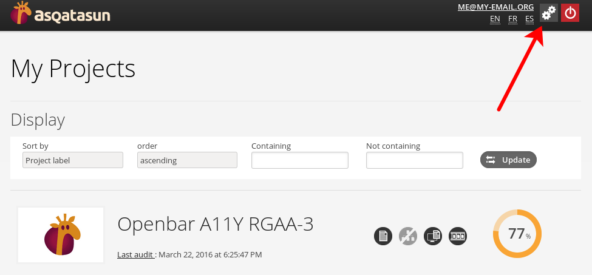

# how to access to the BackOffice

Once logged in, you may click on the "gears" icon in the upper right corner. 
(If you don't see it, you may not be an admin.)

Once there, you may:

* create / update / delete users
* create / update / delete projects for each user
